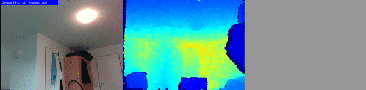

# Project-Template for IW276 Autonome Systeme Labor

<a href="https://iwi-i-wiki.hs-karlsruhe.de/IWI_I/AutonomeSysteme/IW276WS20P6FaceExpressionRecognition"></a>
<a href="https://hub.docker.com/repository/docker/wenzeldock/asl-p6-pyrealsense2"></a>

Short introduction to project assigment.

<p align="center">
  
</p>

> This work was done by Christian Braun, Fabian Wenzel and Bernardo Abreu Figueiredo during the IW276 Autonome Systeme Labor at the Karlsruhe University of Applied Sciences (Hochschule Karlruhe - Technik und Wirtschaft) in WS 2020 / 2021. 

## Table of Contents

- [Project-Template for IW276 Autonome Systeme Labor](#project-template-for-iw276-autonome-systeme-labor)
  - [Table of Contents](#table-of-contents)
  - [Requirements](#requirements)
  - [Prerequisites](#prerequisites)
    - [Docker Execution Prerequisites](#docker-execution-prerequisites)
      - [Source List and GPG Files in `resource` folder](#source-list-and-gpg-files-in-resource-folder)
    - [Nano Execution Prerequisites](#nano-execution-prerequisites)
      - [**torch2trt**](#torch2trt)
      - [**pyrealsense2 (librealsense)**](#pyrealsense2-librealsense)
  - [Pre-trained models <a name="pre-trained-models"></a>](#pre-trained-models-)
  - [Running](#running)
  - [Docker](#docker)
    - [Optional steps (for development):](#optional-steps-for-development)
  - [Acknowledgments](#acknowledgments)
  - [Contact](#contact)

## Requirements

* Jetson Nano
* Jetpack 4.4
* Docker 19.03 (or above)
* Python 3.6 (or above)
* OpenCV 4.1 (or above)
* numpy 1.19.1
* torch 1.6.0
* torchvision 0.7
* face_recognition 1.3.0
* torch2trt (see [Nano Prerequisites](#torch2trt))
* pyrealsense2 2.38.1.2225 (see [Nano Prerequisites](#pyrealsense2-librealsense))

## Prerequisites

Ensure that the camera is connected to the Jetson Nano.  
To check if the camera is connected correctly, you can run `rs-depth` or `rs-enumerate`.   
These commands are avaiable, **after** the installation of the pyrealsense2 library.

1. Clone the repository (https **or** ssh)
```
// https
git clone https://github.com/IW276/IW276WS20-P6.git

// ssh
git clone git@github.com:IW276/IW276WS20-P6.git
```

2. Move inside the directory

```
cd IW276WS20-P6
```

3. Enable the jetson_clocks (to increase install/execution performance)  

```
sudo jetson_clocks
```

4. Optional: Increase the size of the available swap size

Follow the instructions at [this repository](https://github.com/JetsonHacksNano/resizeSwapMemory).

### Docker Execution Prerequisites

#### Source List and GPG Files in `resource` folder
We need these two files to install some libraries (e.g. opencv2) using apt inside the build process for the image:
```
/etc/apt/sources.list.d/nvidia-l4t-apt-source.list
/etc/apt/trusted.gpg.d/jetson-ota-public.asc
```
These are currently located at the `resource` folder.  
If there is a newer version of Jetpack installed, you might to manually place these files inside the folder again.  
[Read the comment for more information](https://github.com/dusty-nv/jetson-containers/issues/5#issuecomment-632829664)

To build and run the docker container proceed [here](#docker).

### Nano Execution Prerequisites

- Install all required dependencies from the [`requirements.txt`](./requirements.txt)

```
pip3 install -r requirements.txt
```

Some dependencies are not available via pip. The following sections guide the installation.

#### **torch2trt**

torch2trt is needed for the conversion of the pytorch model to the tensorRT model and the execution of the converted model.
torch2trt at this stage is not available via pip.
You need to clone the [repository](https://github.com/NVIDIA-AI-IOT/torch2trt/) and follow the [setup](https://github.com/NVIDIA-AI-IOT/torch2trt/#setup).

Setup:
```
git clone https://github.com/NVIDIA-AI-IOT/torch2trt
cd torch2trt
python setup.py install
```

#### **pyrealsense2 (librealsense)**

The pip version of the library is not available for devices with arm architecutre.  
So we need to install the library from the repository.

https://github.com/IntelRealSense/librealsense/blob/master/doc/installation.md
```
git clone https://github.com/IntelRealSense/librealsense
mkdir librealsense/build
cd librealsense/build
cmake ../ -DBUILD_PYTHON_BINDINGS=bool:true -DCMAKE_BUILD_TYPE=release -DBUILD_WITH_CUDA:bool=true
make -j4 VERBOSE=1 
make install
```

You can check whether the installation was successfull with:
```
python3 -c "import pyrealsense2"
```

It can occur that the module cannot be found.
The installation command `make install` fails to copy needed files/scripts to the correct python 3.x library folder. 
The location for the **pyrealsense2** folder can vary for each device / operating system.

In general two additional steps need to be done:
* Copy the `pyrealsense2` folder into the correct python 3.x library folder
* Copy the missing `__init__.py` file into the pyrealsense2 folder 

For example the steps on the Jetson Nano look like this:

```
mv /usr/local/lib/python3.6/pyrealsense2 /usr/local/lib/python3.6/dist-packages
mv ./librealsense/wrappers/python/pyrealsense2/__init__.py /usr/local/lib/python3.6/dist-packages/pyrealsense2
```

## Pre-trained models <a name="pre-trained-models"></a>

Pre-trained model is available at `resources/pretrained-models/`.  
To unzip it execute:
```
7z x resnet50.224.pth.7z
```

We also serve a converted trt-model at `resources/trt-models/`  
To unzip it execute:
```
7z x resnet50.224.trt.pth.7z.001
```
**This model is converted with PyTorch 1.6 and may not work with other versions!**

## Running

Before running the scirpts directly on the nano (without docker) you need to successfully accomplishe the [nano prerequisites](#nano-execution-prerequisites).

To run the demo, pass path to the pre-trained checkpoint and camera id (or path to video file):
```
python3 pipeline.py ../resources/trt-models/resnet50.224.trt.pth
```
> Additional comment about the demo.

- Laufen lassen der Applikation direkt über den Container bei CMD/Entrypoint
- oder über die bash shell im Container über

## Docker

Before building and running the container you need to successfully accomplishe the [docker prerequisites](#docker-execution-prerequisites).

The image executes the pipeline.

1. Build the docker image

```
sudo docker build . -t wenzeldock/asl-p6-pyrealsense2:3.2.0
```

You can also run the bash script:
```
./docker_build.sh
```

This step can take up between 1h to 1h 30min.

2. Execute the Image

We need a lot of parameters to execute the image.  
The reason is the forwarding of the display, the camera access and the volume.

To start the image:
```
sudo docker-compose up --build
```

### Optional steps (for development):

- Comment the model conversion from the docker image:
After the inital conversion we store the converted image at the volume folder.
For future docker builds you can use the previous converted model and safe build time.

- Use the bash shell inside the container:
Sometimes it is useful to use the bash shell to test new implementations or tweak parameters.
Change the last line: 

```
CMD ...
```
for following line: 
```
ENTRYPOINT /bin/bash
```

To enter the bash shell:
```
sudo docker-compose run asl-p6
```


## Acknowledgments

This repo is based on
  - [Source 1](https://github.com/)
  - [Source 2](https://github.com/)

- P2 erwähnen 
- librealsense beispiel für alignement und segmentation
- multithreading mit queue 
- erklärungen um den docker container auf der nano korrekt bauen zu können

Thanks to the original authors for their work!

## Contact
Please email `mickael.cormier AT iosb.fraunhofer.de` for further questions.
